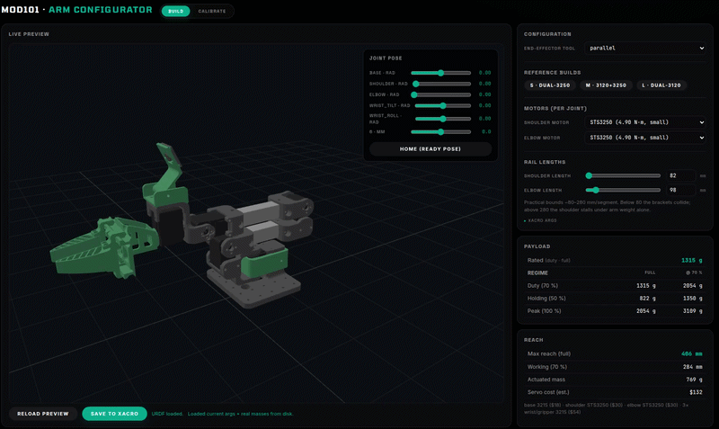
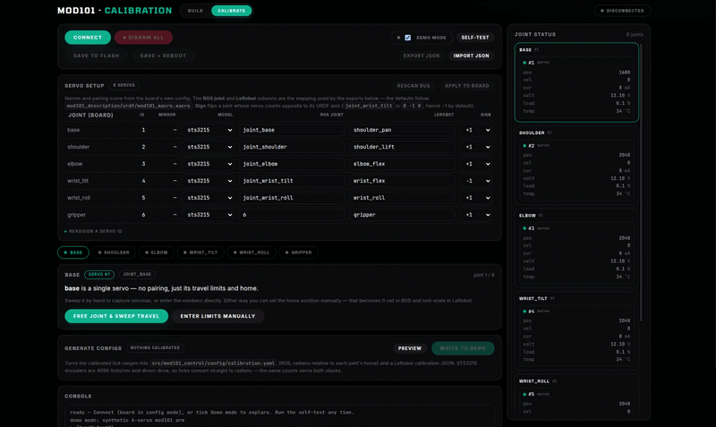

# mod101


**An open-source, universal robot arm platform.**

Robot arms are cool,  but no two people want the same one. Bolt a dremel to it
for light machining and you need a short reach and real payload. Put a camera
on it for inspection work and you want the exact opposite: long reach, almost
nothing to carry. Yet nearly every platform out there, commercial and open
source alike, picks one point on that tradeoff and casts it in stone.

mod101 doesn't. It's a 5-DOF arm designed as a *base* you build on: size it for
your reach envelope, snap in whichever tool the job needs (gripper, vacuum,
camera, dispenser…), and drive it with whatever stack you like — ROS 2, MoveIt,
direct serial, LeRobot.

## Features

- 🔧 **Resize it** — shoulder and elbow extrusions are parametric; tweak from the web configurator with live preview.
- 🧰 **Hot-swap tools** — every end-effector is its own ROS 2 package. Ships with a parallel-jaw gripper, a PincOpen pincer, and a blank end-cap.
- 🤖 **Embeddable** — the whole arm is a prefix-parameterized xacro macro; mount one (or two, or four) on any robot with a one-line `<xacro:mod101_arm .../>` call. No name collisions, no forking.
- 💪 **Lifts up to 3kg and more** with two ST3120 servos — same brackets, just bigger shoulder servos.
- 📏 **Reaches up to 80cm and more** with long extrusions and beefy servos.
- 🌐 **Web configurator** — `python3 configurator/server.py` and you're can use the interactive configurator to tweak the arm to your liking. 
- 🎯 **Guided calibration** — move each joint by hand and the browser learns its limits, flags a binding joint, and writes the config for both ROS 2 and LeRobot.
- 🧠 **MoveIt 2 ready** — motion planning, collision-aware IK and trajectory execution in one launch, with a solver that actually suits a 5-DOF arm. The SRDF is parametric too, so it follows your build.
- 🛠️ **Real structure, not a printed shell** — 2020 aluminum extrusions + PETG-CF brackets at the joints.
- 🌍 **Open** — MIT licensed, no proprietary parts, BOM under $135 entry-level.


## Configurator

**Work out what arm you actually need — before you cut any aluminum or buy a
single servo.**

```bash
source /opt/ros/jazzy/setup.bash   # the 3D preview needs this
python3 configurator/server.py     # then open http://localhost:8001/
```

Drag the sliders and the arm rebuilds itself in front of you. Make the forearm
longer and watch the reach grow — and the payload drop. Swap the shoulder to a
beefier servo and watch it climb back. Every change answers the question that
actually matters when you're about to spend money: *will this arm do my job?*



Four things to decide:

- **How long** — shoulder and forearm rail lengths, i.e. how far it reaches.
- **How strong** — which servo at the shoulder and the elbow.
- **What's on the end** — gripper, pincer, single jaw, or nothing.
- **Or just start from a preset** — **S**, **M** and **L** are known-good
  builds if you'd rather not start from scratch.

And it tells you, live, what you'd get:

- **What it can lift**, at full stretch and pulled in — plus *which joint*
  gives out first, so you know what to upgrade.
- **How far it reaches** and **what it weighs**, from the real printed part
  masses.
- **What the servos cost** — usually the number that decides the build.

Grab the joint sliders to pose it and check the arm actually reaches into your
workspace. When it looks right, hit **Save**: that configuration *is* your
robot from then on, in sim and on the bench. Nothing to copy by hand.

Endpoint reference and internals: [`docs/configurator.md`](docs/configurator.md).


## Calibration

**You've built the arm. Now teach it where its joints actually stop.**



Straight off the bench a servo has no idea which way it's mounted or how far
the bracket lets it swing. Calibration is what turns six motors into a robot
that matches the URDF — and it's the step where you find out whether you
assembled it correctly.


Plug the arm and go joint by joint. Each one:

- **Goes limp so you can move it by hand.** Swing it stop to stop and the
  wizard watches where it actually travels — no guessing at limits, no
  numbers to look up. It backs off slightly from each hard stop so the servo
  never grinds.
- **Gets a verdict — clean, binding, or fault.** This is the part worth having.
  A joint that catches, or an encoder that slipped during assembly, shows up
  here as a bad sweep instead of as a crash later with a gripper full of your
  workpiece.
- **Powers up carefully.** It re-arms slowly and checks how hard the servo is
  pulling before letting it move. Too much current and it disarms itself,
  which usually means something is fighting the joint.
- **Gets a drive test**, so you can watch it track across the range you just
  set before trusting it.

The arm is left powered down at every exit, including if you close the tab or
yank the cable.

When you're done, **Write to repo** saves the results for both ROS 2 and
LeRobot, so the arm you calibrated is the arm your code drives.

No hardware yet? Tick **Demo mode** and the whole flow runs against a
simulated arm — a good way to see what you're in for before you order servos.

Talks to the servos directly over the USB-TTL adapter (`pip install st3215`) —
no intermediate firmware, and nothing is written to servo EEPROM. Any browser.
Full details, including the joint/servo mapping and the tick math:
[`docs/calibration.md`](docs/calibration.md).

## Tools

Every end-effector is a standalone ROS 2 package (`mod101_tool_<name>`) carrying its own URDF, controllers, gazebo extensions, and launch fragment. Pick one at launch time with `tool:=<name>`.

| Tool | Preview | Description | 
|---|---|---|
| `parallel` |  | Parallel-jaw gripper, single prismatic joint with a mimic'd right jaw. |
| `pincopen` |  | [PincOpen](https://github.com/CNURobotics/pinc_open_driver) pincer gripper (Pollen Robotics). Single revolute drive + 4-bar linkage. | 
| `jaws` |  | SO-101 single-jaw gripper — moving jaw rotates against the fixed wrist-roll body. Cheapest tool, just one extra servo. **Default.** | 
| `none` |  | Blank end-cap. No actuators — useful as a baseline or a template for a new tool. |

Adding your own is a one-package job (URDF + ros2_control + SRDF + launch). See [`docs/tool-convention.md`](docs/tool-convention.md) for the coordinate convention every tool follows, and [`docs/ros-architecture.md`](docs/ros-architecture.md#adding-a-new-tool) for the package contract.


## Getting started

You'll need ROS 2 Jazzy on Ubuntu 24.04. Everything else (Gazebo Harmonic, `ros2_control`, `gz_ros2_control`) installs via apt.

```bash
# 1. Clone next to (or into) a colcon workspace
git clone https://github.com/<you>/mod101.git ~/robots/mod101
cd ~/robots/mod101

# 2. Build the arm + the tools you want
colcon build --packages-select \
  mod101_description mod101_control mod101_gazebo mod101_moveit_config \
  mod101_tool_parallel mod101_tool_pincopen mod101_tool_jaws mod101_tool_none
source install/setup.bash

# 3. Launch sim — pick a tool with the `tool:=` arg
ros2 launch mod101_gazebo gazebo.launch.py tool:=parallel
```

Want motion planning? `sudo apt install ros-jazzy-moveit ros-jazzy-pick-ik`, then:

```bash
ros2 launch mod101_moveit_config demo.launch.py   # Gazebo + MoveIt + RViz
```

Plan and execute from the RViz MotionPlanning panel. Full walkthrough, including
a scripted first motion:
[`docs/moveit-getting-started.md`](docs/moveit-getting-started.md).

One thing worth knowing up front: mod101 is a 5-DOF arm, so it plans to
**positions**, not full 6-DOF poses — the guide explains why and what that means
for grasps.

Try the configurator while sim is running:

```bash
python3 configurator/server.py  # http://localhost:8001/
```


## Embedding in another robot

The arm is defined as the `mod101_arm` xacro macro
(`mod101_description/urdf/mod101_macro.xacro`); the standalone `mod101.xacro`
is just a thin wrapper that instantiates it once with an empty prefix. Any
robot can include the macro file and bolt on as many arms as it likes:

```xml
<xacro:include filename="$(find mod101_description)/urdf/mod101_macro.xacro"/>

<xacro:mod101_arm prefix="left_arm_"  parent="left_arm_bracket"
                  xyz="0 0.06 0.024" rpy="0 0 0"
                  tool="jaws" use_sim="true"/>
<xacro:mod101_arm prefix="right_arm_" parent="right_arm_bracket"
                  xyz="0 -0.06 0.024" rpy="0 0 0"
                  tool="jaws" use_sim="true"/>
```

| Param | Default | Meaning |
|---|---|---|
| `prefix` | `''` | Prepended to **every** link/joint name. Joints become e.g. `left_arm_1 … left_arm_6`; the wrist camera topic becomes `<prefix>wrist_camera/image_raw`. |
| `parent` | `''` | Link to bolt the arm base onto via a fixed `<prefix>base_mount` joint. Empty = no mount joint (the caller anchors `<prefix>base_link` itself). |
| `xyz`, `rpy` | `0 0 0` | Mount joint origin in the parent frame. The base plate is 80×100 mm, centred on `base_link`. |
| `tool` | `jaws` | End-effector package (`mod101_tool_<tool>`). |
| `use_sim` | `true` | Emit the gz_ros2_control hardware blocks + gazebo extensions. |

The macro emits a complete, independently named `<ros2_control>` system per
instance (plus one per tool), so a single `gz_ros2_control` plugin /
controller_manager handles them all — the integrator just declares the
plugin once and supplies controller YAML with the prefixed joint names. The
reference integration is the base101 dual-arm workspace (two arms on a
mobile base's lift tower).


## Optional: `mod101_harness`

`mod101_harness` is an **optional overlay** package (built with the rest,
depended on by nothing): the arm on a bench test harness — 2020 extrusion base,
camera tower with an actuated pan/tilt head and a RealSense depth camera. It
reuses mod101's arm description and controller set unchanged and adds only the
harness structure, the two `hn_pan_joint` / `hn_tilt_joint` joints (one extra
controller, `config/pan_tilt_controllers.yaml`) and the depth camera. Two
launch files:

```bash
# whole robot in Gazebo: arm + pan/tilt + RealSense depth (RGB/depth/points on
# /harness/depth_camera/*) + the arm's wrist camera, all bridged
ros2 launch mod101_harness sim.launch.py

# prepared-for-hardware skeleton: robot_state_publisher + controller_manager on
# a mock_components placeholder, same controllers spawned. Runs as fake hardware
# as-is; swap the plugin in urdf/mod101_harness_arm.xacro to go live.
ros2 launch mod101_harness hardware.launch.py
```

Same `tool:=` / rail-length / mount args as `mod101_gazebo`. No MoveIt launch —
point `mod101_moveit_config`'s `move_group` at this package's xacro/srdf if you
want planning. The arm mount pose was solved by rigidly aligning the export's
stand-in base against `base_link.stl`; `urdf/harness_body.xacro` is the ported
geometry, `export/` the untouched baseline for the next re-export.

### Deeper docs

**Get it moving**

- **[docs/moveit-getting-started.md](docs/moveit-getting-started.md)** — the walkthrough: install to first executed motion, ~15 minutes, no hardware
- **[docs/moveit.md](docs/moveit.md)** — the MoveIt reference: the 5-DOF IK story, what to regenerate when you change the build, controller wiring, and what every planning failure means

**Change it**

- **[docs/configurator.md](docs/configurator.md)** — sizing the arm: endpoint reference, how the live xacro edit works, what a Save does and doesn't do
- **[docs/tool-convention.md](docs/tool-convention.md)** — coordinate convention for tool URDFs (mount joint identity, `+X` outward, `+Z` up, bolt pattern at origin)
- **[docs/calibration.md](docs/calibration.md)** — hardware bring-up: the per-joint sweep wizard, and the ROS + LeRobot config it generates

**Understand it**

- **[docs/ros-architecture.md](docs/ros-architecture.md)** — package layout, the tool contract, controllers, the joint table, real-hardware wiring, known gotchas
- **[docs/performance-notes.md](docs/performance-notes.md)** — measured performance, where bringup time really goes, and the middleware traps that masquerade as code bugs

**History** — kept for reasoning and measurements, not current documentation

- **[docs/worklogs/moveit.md](docs/worklogs/moveit.md)** — the original MoveIt handover note and the collision-matrix measurements behind today's design


## BOM

### Base Config (~$134)

| Part | Qty | Unit Price | Subtotal |
|---|---|---|---|
| [STS3215 servo (12V, 30 kg·cm)](https://www.alibaba.com/product-detail/Low-Cost-Feetech-STS3215-Servo-7_1601611431055.html?spm=a2747.product_manager.0.0.45b471d29yemSr) | 6 | $16.50 | $99.00 |
| 2020 aluminum extrusion (cut to length) | ~0.6m | $5.00/m | $3.00 |
| M5 T-nuts | ~20 | — | $3.00 |
| M5×8 bolts | ~20 | — | $2.00 |
| PLA-CF filament (~150g) | — | — | $8.00 |

| Misc hardware (bolts, nuts, wires) | — | — | $10.00 |
| **Total** | | | **~$134** |

If you want to upgrade the motors for more payload, here are the options: [**STS3250 at 50kg*cm**](https://www.alibaba.com/product-detail/12V-50kg-STS3250-Coreless-Motor-Magnetic_1601756525163.html?spm=a2747.product_manager.0.0.504a71d28VYAsz) or [**the 120kg*cm beast STS3120**](https://www.alibaba.com/product-detail/Feetech-STS3120M-12V-120kg-High-Performance_1601816393864.html?spm=a2700.prosearch.normal_offer.d_title.23b267af0qokIv&priceId=600e3c99632248f89c88849464629777). Brackets are available for both, check the configurator for more details. 

## Related Projects

- **[Axon](https://github.com/robocore-labs/link101-hw)** — RP2350-based multi-protocol bridge (CAN FD / RS485 / Dynamixel / Feetech)
- **[Forge](https://github.com/cristidragomir97/forge)** — ROS 2 deployment orchestration


## Acknowledgments

- Derived from the [SO-101](https://github.com/TheRobotStudio/SO-ARM100) by The Robot Studio.
- Parallel-jaw gripper is the [PathOn 6DOF symmetric gripper](https://github.com/PathOn-AI/pathon_opensource).
- PincOpen pincer tool vendors URDF + meshes from [CNURobotics/pinc_open_driver](https://github.com/CNURobotics/pinc_open_driver) (original gripper design by Pollen Robotics).

## License
MIT
