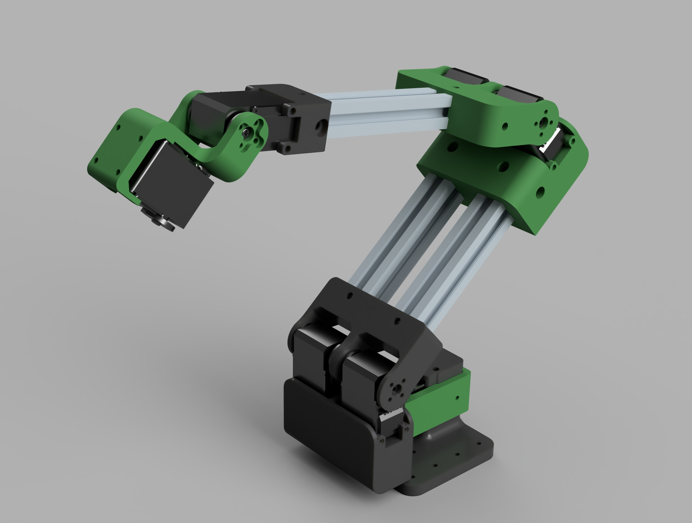

# mod101

**An open-source, universal robot arm platform.**

mod101 is a 5-DOF arm designed as a *base* you build on. Resize it for your reach envelope, snap in whichever tool the job needs (gripper, vacuum, camera, dispenser…), and drive it with whatever stack you like (ROS 2, MoveIt, direct serial).



## Features

- 🔧 **Resize it** — shoulder and elbow extrusions are parametric; tweak from the web configurator with live preview.
- 🧰 **Hot-swap tools** — every end-effector is its own ROS 2 package. Ships with a parallel-jaw gripper, a PincOpen pincer, and a blank end-cap.
- 💪 **Lifts up to 1.65 kg** in the PRO config — same brackets, just bigger shoulder servos.
- 📏 **Reach up to 72 cm** with long extrusions.
- 🌐 **Web configurator** — `python3 configurator/server.py` and you're sizing the arm in three.js.
- 🛠️ **Real structure, not a printed shell** — 2020 aluminum extrusions + PLA-CF brackets at the joints.
- 🌍 **Open** — MIT licensed, no proprietary parts, BOM under $135 entry-level.


## Configurations

Same brackets, same extrusion, same firmware. Just swap servos.

The exact dimensions (link lengths, extrusion size) are parametric — the **[web configurator](docs/configurator.md)** sizes the arm in real time and shows the resulting reach and payload before you cut anything.

### BASE — 8× ST3215 ($134)

- 2× ST3215 shoulder pitch (doubled)
- 2× ST3215 elbow (doubled)
- 1× ST3215 wrist tilt
- 1× ST3215 wrist roll
- 1× ST3215 gripper

| Condition | Payload |
|---|---|
| Continuous (70% stall) | 547g |
| Stall (100%) | 906g |
| Continuous @ 70% reach | 852g |

Bottleneck: shoulder pitch (doubled elbow has 2× headroom).

### PRO — 2× STS3250 shoulder + 6× ST3215 ($211)

Swap two shoulder servos from ST3215 to STS3250. Everything else stays identical.

| Condition | Payload |
|---|---|
| Continuous (70% stall) | 1,105g |
| Stall (100%) | 1,703g |
| Continuous @ 70% reach | 1,649g |

> **Payload note.** All numbers assume worst-case: arm fully extended horizontal, sustained hold. At a 45° working angle (typical tabletop pick-and-place), available payload roughly doubles — the robot can *move* 1 kg+ through most of its workspace on BASE; it just can't *hold* it at full horizontal extension.


## Tools

Every end-effector is a standalone ROS 2 package (`mod101_tool_<name>`) carrying its own URDF, controllers, gazebo extensions, and launch fragment. Pick one at launch time with `tool:=<name>`.

| Tool | Preview | Description | Active joints |
|---|---|---|---|
| `parallel` |  | Parallel-jaw gripper, single prismatic joint with a mimic'd right jaw. Default. | `6` (prismatic, ±13 mm) |
| `pincopen` |  | [PincOpen](https://github.com/CNURobotics/pinc_open_driver) pincer gripper (Pollen Robotics). Single revolute drive + 4-bar linkage. | `6` (revolute, −2.44…0 rad) |
| `none` |  | Blank end-cap. No actuators — useful as a baseline or a template for a new tool. | — |

Adding your own is a one-package job (URDF + ros2_control + launch). See [`docs/ros-architecture.md`](docs/ros-architecture.md#adding-a-new-tool) for the contract.


## Getting started

You'll need ROS 2 Jazzy on Ubuntu 24.04. Everything else (Gazebo Harmonic, `ros2_control`, `gz_ros2_control`) installs via apt.

```bash
# 1. Clone next to (or into) a colcon workspace
git clone https://github.com/<you>/mod101.git ~/Work/mod101
cd ~/Work/mod101

# 2. Build the arm + the tools you want
colcon build --packages-select \
  mod101_description mod101_control mod101_gazebo \
  mod101_tool_parallel mod101_tool_pincopen mod101_tool_none
source install/setup.bash

# 3. Launch sim — pick a tool with the `tool:=` arg
ros2 launch mod101_gazebo gazebo.launch.py tool:=parallel
```

Try the configurator while sim is running:

```bash
python3 configurator/server.py  # http://localhost:8000/
```

### Deeper docs

- **[docs/ros-architecture.md](docs/ros-architecture.md)** — package layout, the tool contract, controllers, joints, MoveIt + JTC notes, real-hardware wiring, known gotchas
- **[docs/configurator.md](docs/configurator.md)** — endpoint reference, how the live xacro edit works


## BOM

### Base Config (~$134)

| Part | Qty | Unit Price | Subtotal |
|---|---|---|---|
| STS3215 servo (12V, 30 kg·cm) | 6 | $16.50 | $99.00 |
| Waveshare SC09 gripper servo | 1 | $5.00 | $5.00 |
| 2020 aluminum extrusion (cut to length) | ~0.6m | $5.00/m | $3.00 |
| M5 T-nuts | ~20 | — | $3.00 |
| M5×8 bolts | ~20 | — | $2.00 |
| PLA-CF filament (~150g) | — | — | $8.00 |
| Pogo pin connector (4-pin) | 1 | $3.00 | $3.00 |
| Misc hardware (bolts, nuts, wires) | — | — | $10.00 |
| **Total** | | | **~$134** |

### PRO Upgrade (+$77)

Replace 2× STS3215 shoulder servos with 2× STS3250 ($55 each). Everything else unchanged.


## Related Projects

- **[Axon](https://github.com/robocore-dev/axon)** — RP2350-based multi-protocol bridge (CAN FD / RS485 / Dynamixel / Feetech)
- **[Bolt](https://github.com/robocore-dev/bolt)** — Power distribution hub
- **[Forge](https://github.com/robocore-dev/forge)** — ROS 2 deployment orchestration
- **[vision-factory](https://github.com/robocore-dev/vision-factory)** — Plug-and-play computer vision pipeline generator


## Acknowledgments

- Derived from the [SO-101](https://github.com/TheRobotStudio/SO-ARM100) by The Robot Studio.
- Parallel-jaw gripper is the [PathOn 6DOF symmetric gripper](https://github.com/PathOn-AI/pathon_opensource).
- PincOpen pincer tool vendors URDF + meshes from [CNURobotics/pinc_open_driver](https://github.com/CNURobotics/pinc_open_driver) (original gripper design by Pollen Robotics).


## License

MIT
